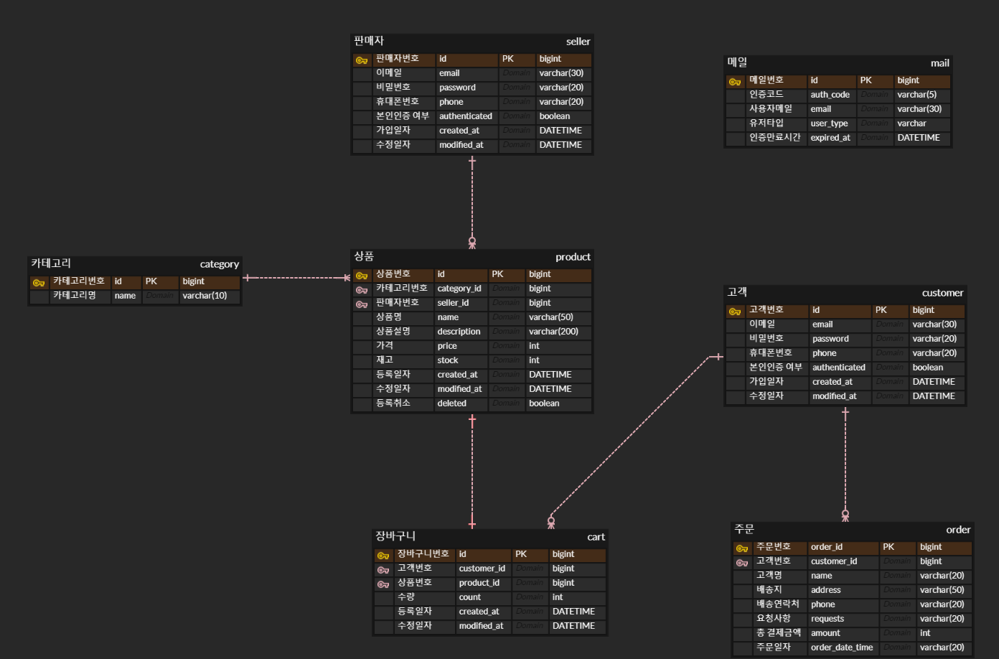

# 이커머스 프로젝트 🛒

## 프로젝트 기능 및 설계

### 상품
- 상품 카테고리
  - 카테고리 등록 기능
- 상품 조회
  - 카테고리 명을 입력하면 상품을 최신순으로 볼 수 있다 (5개씩 페이징 처리)
  - 삭제된 상품은 보이지 않는다.
- 상품 검색
  - 상품번호 검색: 상품번호를 입력하여 검색
  - 키워드 검색: 입력한 키워드가 들어간 상품을 최대 5개까지 출력한다
  - 상품명 검색: 상품명을 입력하면 동일한 이름의 상품들의 정보를 가져온다

### 판매자
- 회원가입
  - 이메일로 본인인증
- 로그인
  - JWT토큰 발급 (유효시간 3시간)
- 상품 등록
  - 로그인이 필요하며, 본인인증된 판매자만 등록할 수 있다.
- 상품 수정 및 취소
  - 수정 가능 항목: 상품명, 상품설명, 가격, 재고, 등록취소

### 고객
- 회원가입
  - 이메일로 본인인증
- 로그인
  - JWT토큰 발급 (유효시간 3시간)
  
### 주문
- 장바구니 기능
  - 로그인 필요
  - 상품 담기
  - 상품 수량 수정
  - 상품 삭제
  - 상품 조회
- 주문 기능
  - 로그인이 필요하고, 본인인증 된 회원이어야 한다.
  - 장바구니에 담긴 상품을 모두 구매
  - 주문 전에 상품의 재고 수량이 체크되며, 삭제됐거나 수량 부족한 상품이 있을 시 주문 불가
  - 주문 후 장바구니는 초기화된다.
 

## ERD

 

### ⚒️Tech Stack
- java 11
- Spring Boot 2.7.12

 
   
   
   
  
  
  
  
  

